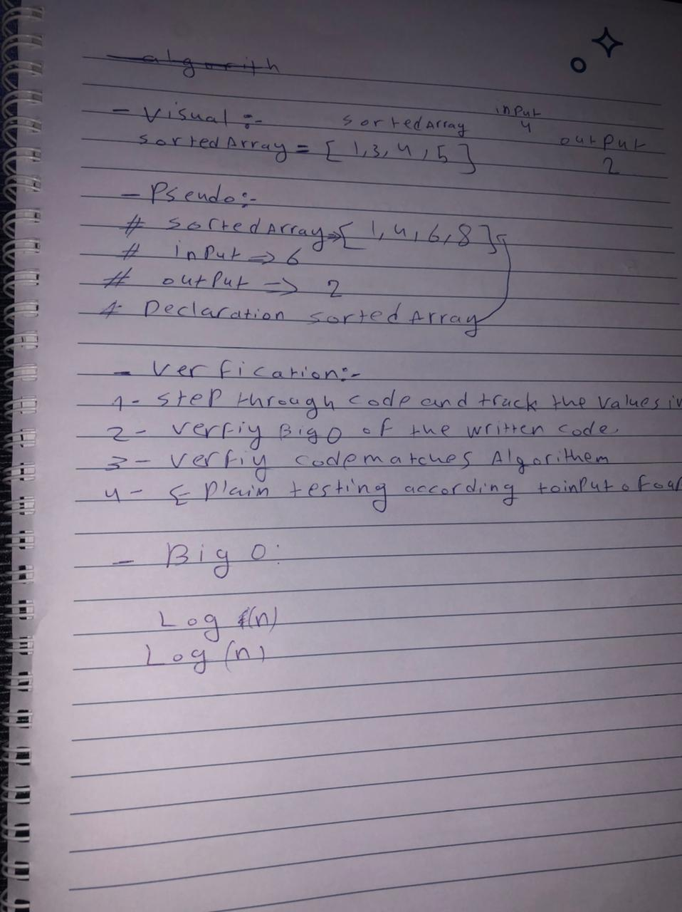

# Binary Search of Sorted Array :

* the user will add a number fro the sotred array , and the user want to get the indexOf this number in the sotred array . 

***

[code in repl](https://replit.com/@MostafaK1/test3#index.js)

***

.jpg)

***

## Approach & Efficiency : 
* we used the log(n) because it's fatser and lightweight . 
