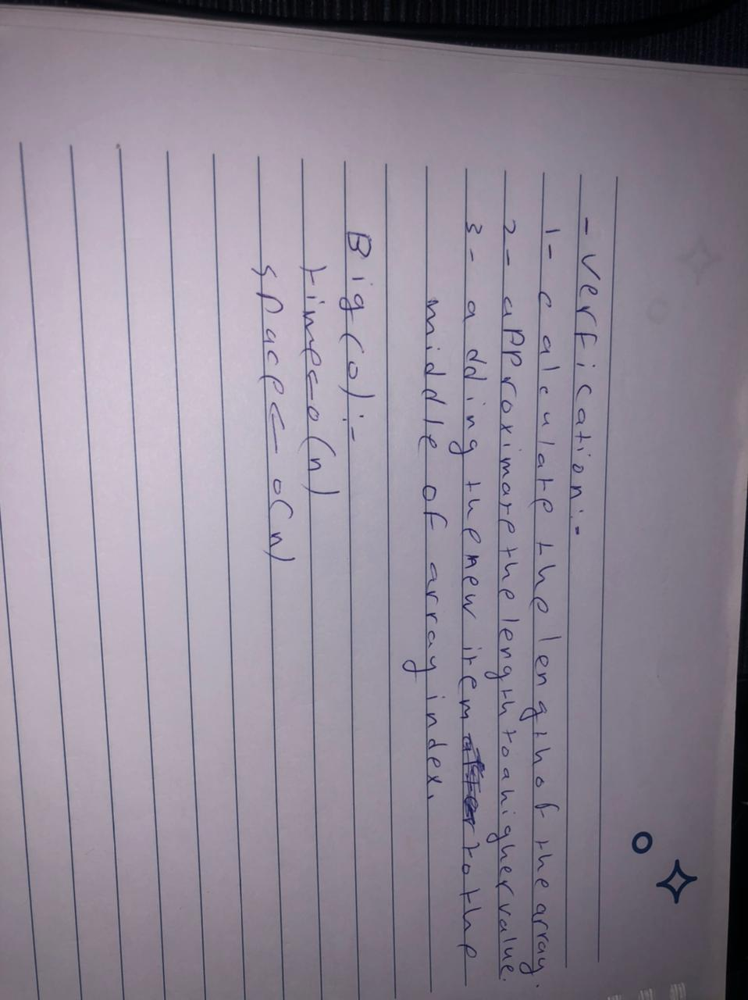

# table of content code challenge 401: 

|file name|link|
|:-------:|:---|
|CC1(readme)|[github](https://github.com/jdeitawimostafa/data-structures-and-algorithms/blob/main/javascript/code-challenges/array-reverse/README.md)|
|CC2(readme)|[github](https://github.com/jdeitawimostafa/data-structures-and-algorithms/blob/main/javascript/code-challenges/array-shift/README.md)|

.jpg)

