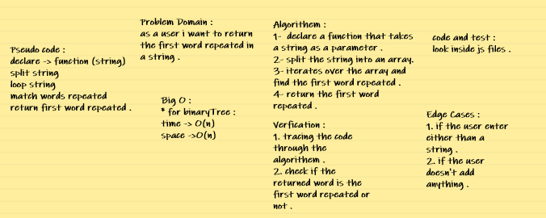

# challenge describtion : 

* Feature Tasks : 

1. Write a function called repeated word that finds the first word to occur more than once in a string .
2. Arguments: string .
3. Return: string .

* Structure and Testing : 

Utilize the Single-responsibility principle: any methods you write should be clean, reusable, abstract component parts to the whole challenge. You will be given feedback and marked down if you attempt to define a large, complex algorithm in one function definition.

Write at least three test assertions for each method that you define.

## code challenge 31 whiteboard : 

