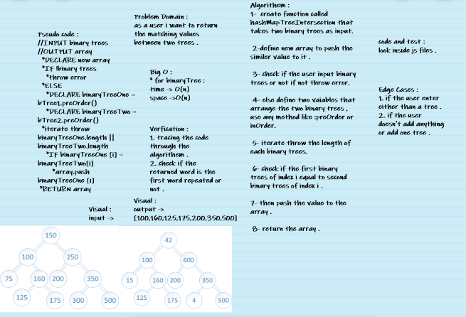

# Feature Tasks

* Find all values found to be in 2 binary trees : 

1. Write a function called tree intersection
2. Arguments: two binary trees
3. Return: array 

## Structure and Testing : 

Utilize the Single-responsibility principle: any methods you write should be clean, reusable, abstract component parts to the whole challenge. You will be given feedback and marked down if you attempt to define a large, complex algorithm in one function definition. 

### code challenge 32 whiteboard :

