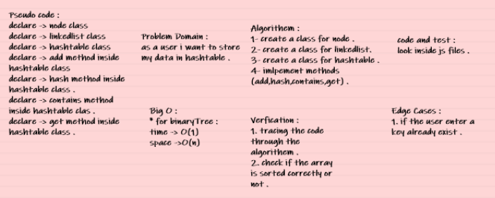

# Hashtables

**A hash is the result of some algorithm taking an incoming string and converting it into a value that could be used for either security or some other purpose. In the case of a hashtable, it is used to determine the index of the array.**

## Challenge

* Implement a Hashtable Class with the following methods:

1. add : 
- Arguments: key, value
- Returns: nothing
- This method should hash the key, and add the key and value pair to the table, handling collisions as needed.

2. get :
- Arguments: key
- Returns: Value associated with that key in the table

3. contains :
- Arguments: key
- Returns: Boolean, indicating if the key exists in the table already.

4. hash : 
- Arguments: key
- Returns: Index in the collection for that key

## Approach & Efficiency

Big O :

- time -> O(1)

- space -> O(n)

## code challenge 30 whiteboard : 

