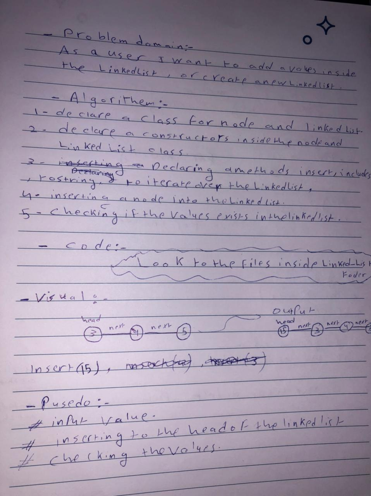
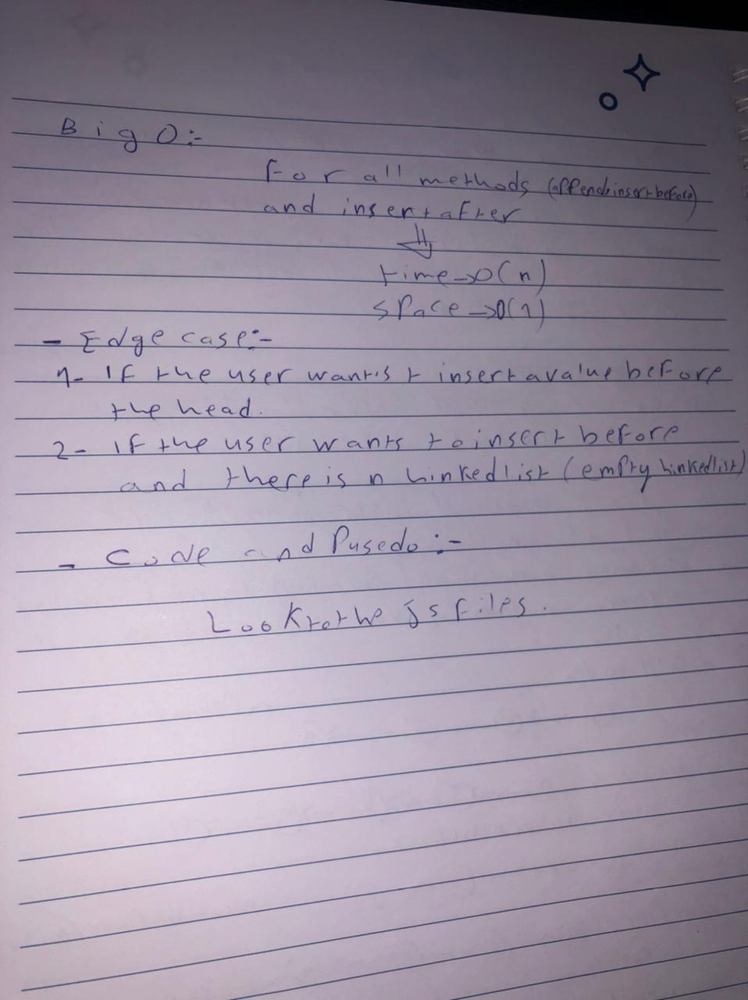
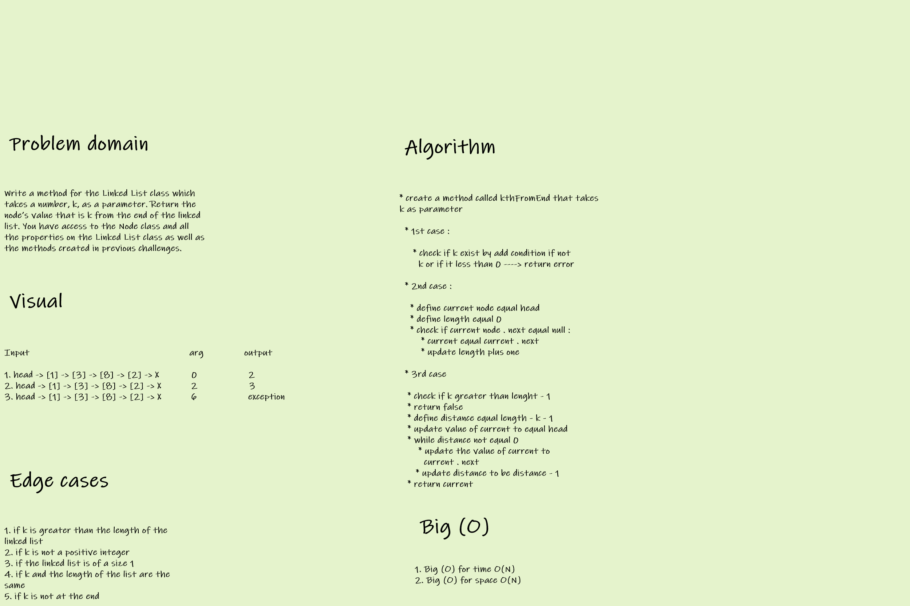

# Singly Linked List : 

* is a linear data structure. It contains head, tail and length properties. As shown below, each element in linked list is a node, which has a value and a reference to next node, or if it's tail, points to null .

## Challenge : 

* Create a Node class that has properties for the value stored in the Node, and a pointer to the next Node.
Within your LinkedList class, include a head property. Upon instantiation, an empty Linked List should be created.
Define a method called insert which takes any value as an argument and adds a new node with that value to the head of the list with an O(1) Time performance.
Define a method called includes which takes any value as an argument and returns a boolean result depending on whether that value exists as a Node’s value somewhere within the list.
Define a method called toString which takes in no arguments and returns a string representing all the values in the Linked List, formatted as:
"{ a } -> { b } -> { c } -> NULL" .

.jpg)

***

### code challenge 6 :

* Write the following methods for the Linked List class:

- append(value) which adds a new node with the given value to the end of the list
- insertBefore(value, newVal) which add a new node with the given newValue immediately before the first value node
- insertAfter(value, newVal) which add a new node with the given newValue immediately after the first value node .

.jpg)

### code challenge 7 :

* Write a method for the Linked List class which takes a number, k, as a parameter. Return the node’s value that is k from the end of the linked list. You have access to the Node class and all the properties on the Linked List class as well as the methods created in previous challenges.

