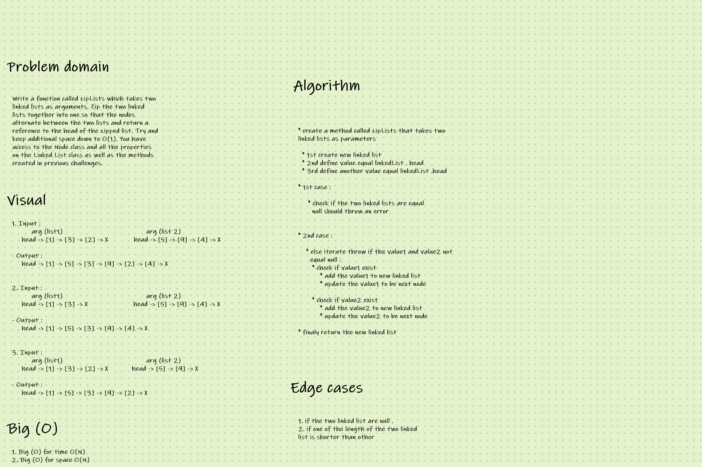

# code challenge 08 : 

## Singly Linked List : 

* is a linear data structure. It contains head, tail and length properties. As shown below, each element in linked list is a node, which has a value and a reference to next node, or if it's tail, points to null .

1. description : 

* Write a function called zipLists which takes two linked lists as arguments. Zip the two linked lists together into one so that the nodes alternate between the two lists and return a reference to the head of the zipped list. Try and keep additional space down to O(1). You have access to the Node class and all the properties on the Linked List class as well as the methods created in previous challenges.

