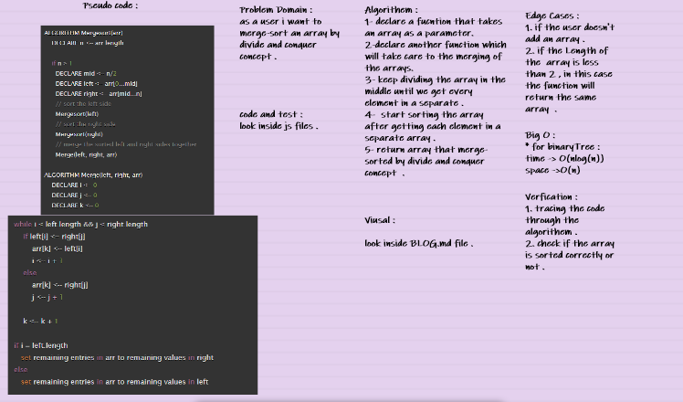

# Merge-sort : 

**Merge sort is a divide-and-conquer algorithm based on the idea of breaking down a list into several sub-lists until each sublist consists of a single element and merging those sublists in a manner that results into a sorted list.**

**While comparing two sublists for merging, the first element of both lists is taken into consideration. While sorting in ascending order, the element that is of a lesser value becomes a new element of the sorted list. This procedure is repeated until both the smaller sublists are empty and the new combined sublist comprises all the elements of both the sublists.**

## Idea:

- Divide the unsorted list into N sublists, each containing 1 element.

- Take adjacent pairs of two singleton lists and merge them to form a list of 2 elements. N will now convert into N lists of size 2.

- Repeat the process till a single sorted list of obtained.

## code challenge 27 Whiteboard : 

### Thanks for reading :)) . 
