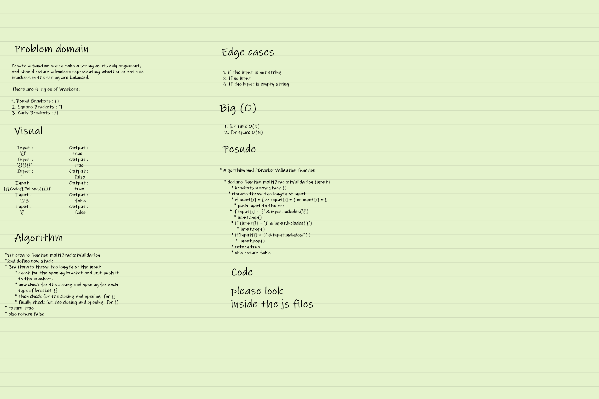

# code challenge : 

* Write a function called multiBracketValidation , Your function should take a string as its only argument, and should return a boolean representing whether or not the brackets in the string are balanced. There are 3 types of brackets:

1. Round Brackets : ()
2. Square Brackets : []
3. Curly Brackets : {} 

## whiteboard : 

