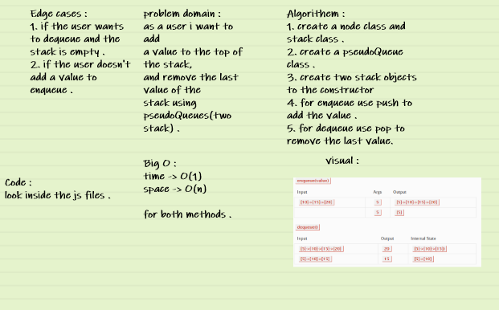

# Stacks and Queues 

* A stack is useful when we want to add elements inside a list into sequential order and remove the last element added. A queue is useful when we want the same behavior, but instead of removing the last added element, we want to remove the first element added to the list .

## code Challenge 11 :

Create a brand new PseudoQueue class. Do not use an existing Queue. Instead, this PseudoQueue class will implement our standard queue interface (the two methods listed below), but will internally only utilize 2 Stack objects. Ensure that you create your class with the following methods:

        enqueue(value) which inserts value into the PseudoQueue, using a first-in, first-out approach.
        dequeue() which extracts a value from the PseudoQueue, using a first-in, first-out approach. 

## API : 
- Stack : 

1. Define a method called push which takes any value as an argument and adds a new node with that value to the top of the stack with an O(1) Time performance.

2. Define a method called pop that does not take any argument, removes the node from the top of the stack, and returns the node’s value, Should raise exception when called on empty stack .

3. Define a method called peek that does not take an argument and returns the value of the node located on top of the stack, without removing it from the stack,Should raise exception when called on empty stack .

4. Define a method called isEmpty that takes no argument, and returns a boolean indicating whether or not the stack is empty.

#  whiteboard : 

