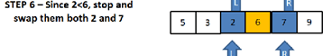

# Quick Sort : 

**Quick Sort algorithm follows Divide and Conquer approach. It divides elements into smaller parts based on some condition and performing the sort operations on those divided smaller parts.** 

# Tracing : 

* Sample array : [5,3,7,6,2,9] 

pass 1 : 

select the pivot .

pass 2 : 

determine the left and right pointers . 

pass 3 : 

since 5<6 , shift left pointer .

pass 4 : 

since 3<6 , shift left pointer and 7>6 , so stop .

pass 5 : 

since 9<6,shift right pointer 

pass 6 : 

since 2<6 ,stop and swap them both 2 and 7

pass 7 : 

move pointers further . 

pass 8 : 

since 6=6 , move pointers further and stop as left crosses right , and the array will sorted and looks like this . 

