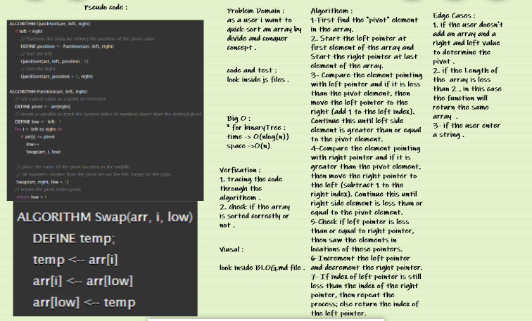

# Quick Sort : 

**Quick Sort algorithm follows Divide and Conquer approach. It divides elements into smaller parts based on some condition and performing the sort operations on those divided smaller parts.** 

## code challenge 28 whiteboard : 

