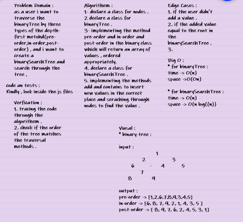
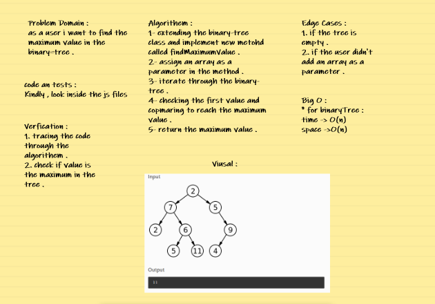

# Binary-tree : 

*  binary tree is a tree data structure in which each node has childrens, which are referred to as the left child and the right child .

* Common Terminology :

1. Node - A Tree node is a component which may contain it’s own values, and references to other nodes
2. Root - The root is the node at the beginning of the tree
3. K - A number that specifies the maximum number of children any node may have in a k-ary tree. In a binary tree, k = 2.
4. Left - A reference to one child node, in a binary tree
5. Right - A reference to the other child node, in a binary tree
6. Edge - The edge in a tree is the link between a parent and child node
7. Leaf - A leaf is a node that does not have any children
8. Height - The height of a tree is the number of edges from the root to the furthest leaf .

* Traversals :

An important aspect of trees is how to traverse them. Traversing a tree allows us to search for a node, print out the contents of a tree, and much more! There are two categories of traversals when it comes to trees:

1. Depth First. 
2. Breadth First. 

## Whiteboard for code challenge 15 :

### Whiteboard for code challenge 16 :

